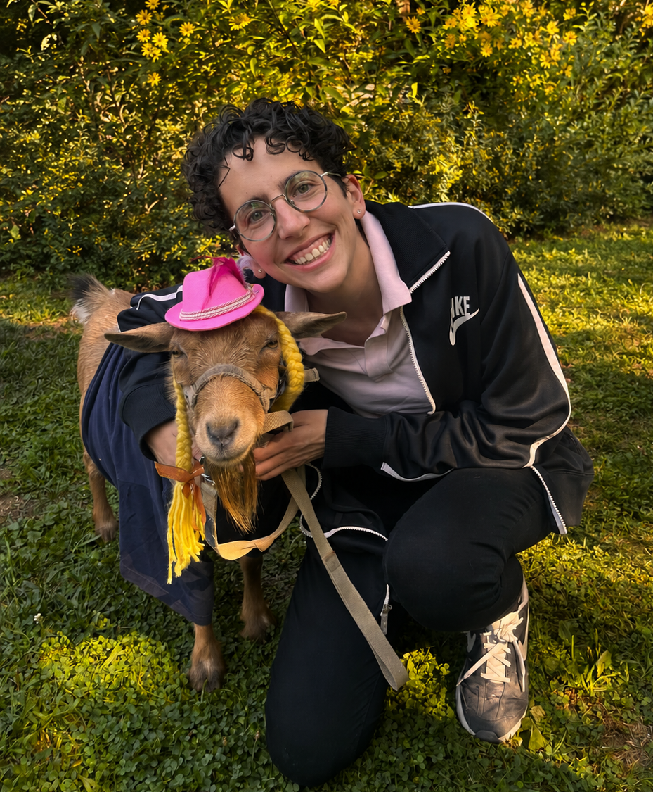

<figure class="bio-photo">
  
  <figcaption>The goat Kyoshi (left) and me (right)</figcaption>
</figure>

¡Hola! I am a Postdoctoral Fellow at <a href="https://pdri-devlab.upenn.edu/" target="_blank" rel="noopener">PDRI-DevLab</a> at the University of Pennsylvania. I am also a <a href="https://ai.upenn.edu/penn-ai-fellows" target="_blank" rel="noopener">Penn AI Fellow</a> and an external Postdoctoral Research Fellow at the <a href="https://povgov.com/" target="_blank" rel="noopener">Poverty, Violence and Governance Lab</a> at Stanford University.

I study the political economy of democratic participation and accountability in the Global South. My current research focuses on the political consequences of violence and on the research design challenges involved in its study. I also study knowledge production in political science. My work has appeared in the <em>Proceedings of the National Academy of Sciences</em> and <em>Perspectives on Politics</em>.

I received my Ph.D. in Politics from <a href="https://www.nyu.edu" target="_blank" rel="noopener">New York University</a> in 2024. I hold a B.A. in Political Science and a B.A. in International Relations from ITAM (2015). Before grad school, I was the Director of Data Analysis at <a href="https://datacivica.org/" target="_blank" rel="noopener">Data Cívica.</a>

You can <a href="https://bsky.app/profile/carotorreblanca.bsky.social" target="_blank" rel="noopener">follow me on Bluesky</a> if you want to read me seldom. I am also working on an ever-expanding compilation of <a href="https://open.spotify.com/playlist/4Al9JKnrYCCIZKlYyR70ku?si=63d507000c5846ce" target="_blank" rel="noopener">the best cover songs</a> you can listen to. Or reach me via <a href="mailto:catba@upenn.edu">email.</a>
